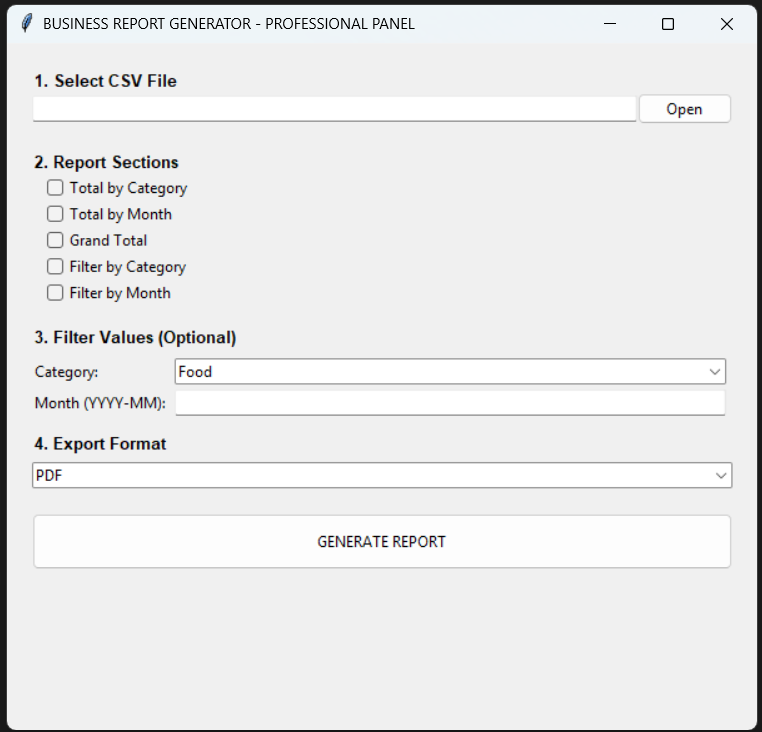
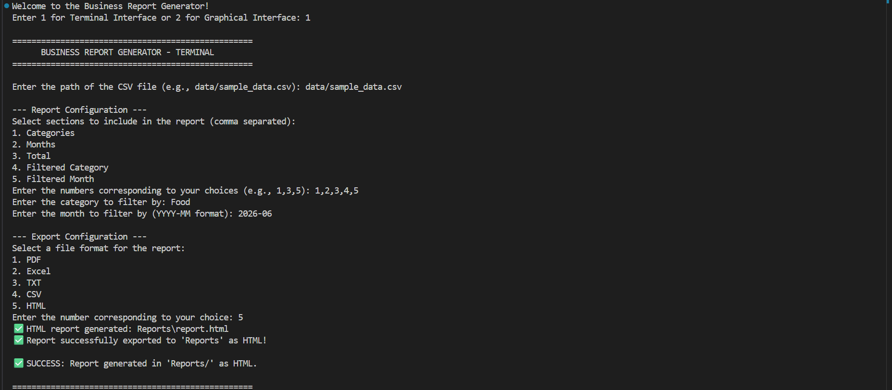
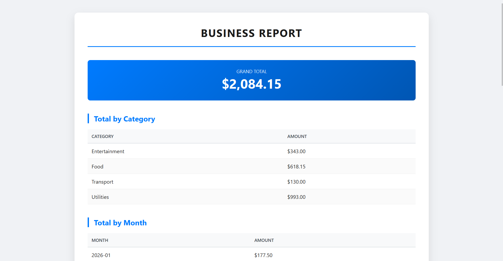
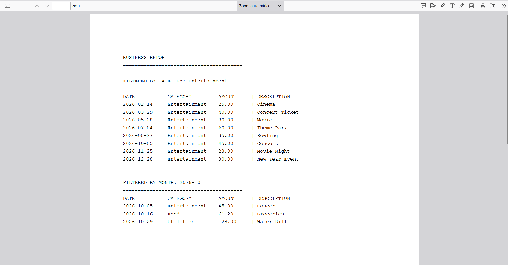

# Business Report Generator


# Business Report Generator

Generate professional business reports from CSV files with support for PDF, Excel, CSV, HTML and TXT exports through both CLI and GUI interfaces.

## 📸 Screenshots

### Graphical Interface



### Terminal Interface



### HTML Report



### PDF Report



## ✨ Features

- **Multiple Export Formats**: Generate high-quality reports in PDF, Excel (.xlsx), CSV, HTML (styled), and TXT.
- **Rich Data Insights**: Automatically calculates Grand Totals, Totals by Category, and Totals by Month.
- **Advanced Filtering**: Deep-dive into your data by filtering reports by specific Categories or Months (`YYYY-MM`).
- **Dual Interface Support**:
    - **CLI**: A clean, efficient Terminal interface for power users.
    - **GUI**: A professional Graphical User Interface built with Tkinter.
- **Professional Output**: Elegant HTML reports with CSS styling and structured PDF layouts.

## 🚀 Installation

### 1. Clone the repository

```bash
git clone https://github.com/rafarsc87/business-report-generator.git
cd business-report-generator
```

### 2. Install dependencies

```bash
pip install -r requirements.txt
```

## ▶️ Run the Application

```bash
python SRC/main.py
```

When the application starts, choose between the **Terminal Interface** and the **Graphical Interface**.

## 📂 Project Structure

```text
business-report-generator/
├── Data/                     # Sample data files
├── Images/                   # README screenshots
│   ├── gui.png               
│   ├── terminal.png
│   ├── html_report.png
│   └── pdf_report.png
├── Reports/                  # Generated reports (auto-created)
├── SRC/
│   ├── main.py               # Application entry point
│   ├── loader.py             # CSV data loading and date parsing
│   ├── processor.py          # Data aggregation and filtering logic
│   ├── report_builder.py     # Orchestrates data processing for reports
│   ├── report_generator.py   # Generates formatted text summaries
│   ├── exporter.py           # Multi-format export engine (PDF, Excel, etc.)
│   ├── gui_interface.py      # Tkinter GUI implementation
│   ├── terminal_interface.py # CLI menu implementation
│   ├── input_handler.py      # CLI user input logic
│   └── constants.py          # Shared constants and configurations
├── README.md                 # Project description and usage instructions
├── requirements.txt          # Project dependencies
├── LICENSE                   # MIT License
└── .gitignore
```

## 🛠️ Technical Stack

- **Core**: Python 3.8+
- **Data Processing**: Pandas & NumPy
- **PDF Generation**: FPDF2
- **Excel Integration**: XlsxWriter + Openpyxl
- **GUI**: Tkinter


## 💡 Usage Guide

After launching the application:

1. Select the interface (Terminal or GUI).
2. Choose the input CSV file.
3. Select the report sections to generate.
4. Optionally apply category or month filters.
5. Choose the export format.
6. The generated files will be automatically saved in the `Reports/` directory.

## 📸 Example Workflow

```text
Input CSV
      │
      ▼
Business Report Generator
      │
      ├── PDF Report
      ├── Excel Report
      ├── CSV Files
      ├── HTML Report
      └── TXT Report
```

## 📄 License   
This project is licensed under the MIT License - see the `LICENSE` file for details.


## 👨‍💻 Connect with me

[](https://www.linkedin.com/in/rafael-salgado-940ab9406)

[](https://github.com/rafarsc87)


## 👨‍💻 Developed By

Rafael Salgado
*Python Developer | Automation & Data Processing Solutions*